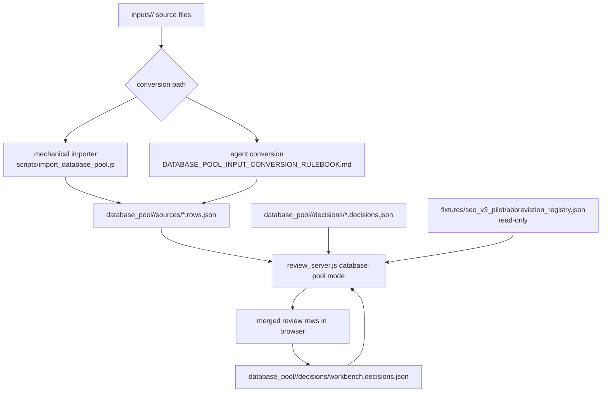
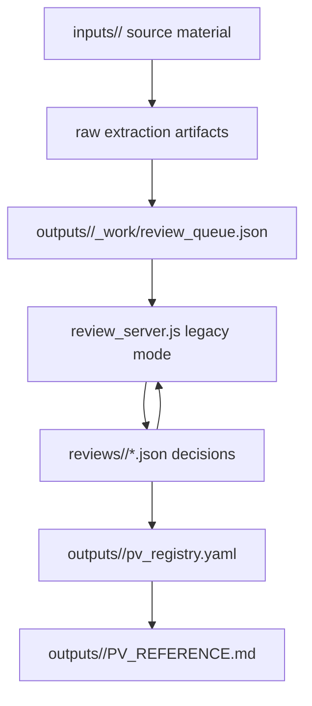

# Current Data Pipeline

Status: planning artifact, not an active rulebook, schema, or naming policy.

This file describes the current data-processing pipeline as observed on
2026-06-01.

## SEO_V3 Database-Pool Pipeline



## Mechanical Importer

`scripts/import_database_pool.js` delegates to
`scripts/database_pool_pilot/importer.js`.

Current behavior:

- scans supported file extensions under the input directory;
- extracts PV-like tokens with regular expressions;
- maps source device/signal tokens through fixed mapping rules;
- writes `needs_input` source rows when invoked with `--write`;
- records `sourceTrace.sourceKind: "database_pool_import"`;
- marks rows as aggressive inference requiring human review.

This path is not natural-language understanding. In the current repository it
is separate from agent-mediated conversion.

## Agent-Mediated Conversion

For source material that the importer cannot parse safely, agents use:

```text
rules/draft/DATABASE_POOL_INPUT_CONVERSION_RULEBOOK.md
```

Current required behavior:

- read source material under `inputs/<pool_id>/`;
- preserve `poolId`, `sourceId`, `sourceAnchor`, and `uid`;
- set `sourceTrace.sourceKind: "agent_input_conversion"`;
- default interpreted rows to `reviewStatus: "needs_input"`;
- keep uncertain abbreviations and assumptions reviewable.

This procedure exists, but there is no separate automated natural-language
importer command.

## Database-Pool Review Server

`scripts/review_server.js --database-pool <pool_id> --port 8212` currently:

- loads explicit database pools;
- reads `sources/*.rows.json`;
- reads `decisions/*.decisions.json`;
- gives `workbench.decisions.json` effective overlay precedence;
- merges source rows and decision overlays by `uid`;
- computes orphan decisions and duplicate approved `standardPv` conflicts;
- loads the abbreviation registry as read-only input;
- computes abbreviation issues for database-pool rows;
- adapts SEO_V3 rows to the existing review table UI;
- saves changed decisions to
  `database_pool/<pool_id>/decisions/workbench.decisions.json`.

The server is a review surface. It does not rewrite source rows.

## Abbreviation Data

Current abbreviation data lives at:

```text
fixtures/seo_v3_pilot/abbreviation_registry.json
```

The registry is machine-readable and validated by database-pool checks. It is
currently read-only from the browser review server. Dedicated abbreviation
review and edit behavior is deferred.

## Validation

Current documentation and workflow validation:

```text
node scripts/validate_workflow_docs.js
git diff --check
```

Current aggregate database-pool validation:

```text
node scripts/validate_database_pool.js
```

Some validators create temporary fixtures or HTTP servers. In a read-only
sandbox those checks may fail for environmental reasons even when the workflow
contract is valid.

## Legacy SEO_v2 Pipeline



The legacy path remains available for historical ID10 output and compatibility
scripts. It should not be treated as the default new-work path.
