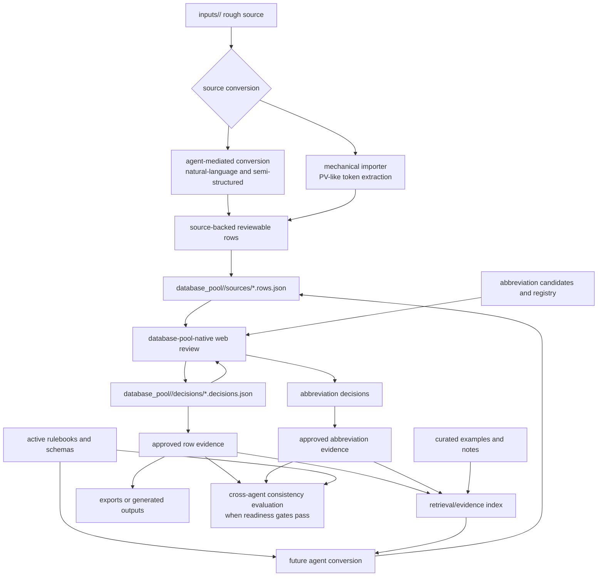

# Target Data Pipeline

Status: planning artifact, not an active rulebook, schema, or naming policy.

This file sketches the desired long-term data-processing pipeline. It is a
planning target, not an implementation change. SEO_v2 / v0 pipelines were
removed in the 2026-06-02 hard-reset alignment and are non-goals.

## Target Flow

## Source Conversion

The target keeps two explicit source conversion modes:

- mechanical import for PV-like token extraction and deterministic/aggressive
  mappings;
- agent-mediated conversion for natural-language, semi-structured, or
  importer-unfriendly source material.

Both modes write source-backed reviewable rows. Both must preserve
`poolId`, `sourceId`, `sourceAnchor`, and deterministic `uid`. Neither mode
should silently approve interpreted rows.

## Review

The web review UI should remain database-pool-native:

- show merged source rows plus decision overlays;
- expose row review states directly from the SEO_V3 durable vocabulary;
- preserve decision routing by `poolId` and `uid`;
- include conflict review for duplicate approved PVs, orphan decisions, source
  trace problems, and abbreviation blocking issues;
- include abbreviation review for candidate, approved, deprecated, and rejected
  abbreviation records;
- keep source row files read-only from the server;
- save human decisions as overlays.

The UI remains a review surface, not the primary source interpreter.

## Abbreviation Review

Abbreviation review should happen before bulk approval of large row sets.

The target abbreviation workflow should:

- record code, kind, meaning, status, scope, source, and rationale;
- show row usage/evidence for each abbreviation;
- allow candidate abbreviations to be approved, rejected, deprecated, or left
  pending;
- treat rows whose component abbreviations are approved and unambiguous as
  approval-eligible;
- add usage evidence when a PV row is approved;
- require explicit review before a PV approval promotes any abbreviation with
  possible code, meaning, or scope conflicts;
- prioritize repeated, blocking, or ambiguous abbreviation candidates in the UI
  while keeping one-off candidates searchable;
- warn before changes to approved abbreviations affect already approved rows;
- feed approved abbreviation records into the retrieval/evidence index.

Code-only matching is insufficient for global abbreviation approval. Future
workflow should compare at least kind, code, normalized meaning, scope, source
evidence, aliases, and row usage. Semantic checks by an agent are useful for
ambiguous cases, but the first implementation should use a repository-local
approved evidence index before adding external RAG infrastructure.

Any implementation of PV approval coupled to abbreviation approval needs its
own reviewed goal before code changes.

## Approved Evidence And Retrieval

Approved rows, approved abbreviation records, curated examples, and curated
notes should be searchable as retrieval evidence. The first target is an
in-memory repository-file index, not an external vector database.

Retrieval evidence is advisory:

- it helps agents find precedent;
- it helps stabilize abbreviation and component choices;
- it should cite source rows or approved records;
- it does not override active rulebooks;
- it does not promote policy without explicit review.

## Cross-Agent Consistency

Cross-agent consistency evaluation is a later pipeline stage. It should start
only when the repository has enough approved evidence to define fair expected
outputs.

Entry criteria should include:

- approved device abbreviation records;
- approved subdevice abbreviation records;
- enough non-conflicting approved rows;
- expected outputs justified by source evidence, rules, and approved records;
- disagreement routing to `exceptions/` or `proposals/`.

Until those gates pass, different agent outputs should be treated as reviewable
candidate differences, not failures.

## Export

Exports or generated outputs should be derived from reviewed/approved
database-pool evidence and written under `outputs/`. The `outputs/` directory
is currently empty; export tooling is future work.
