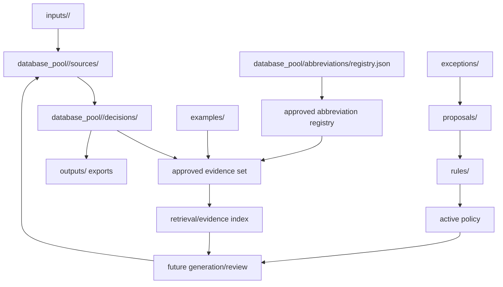

# Target Repository Structure

Status: planning artifact, not an active rulebook, schema, or naming policy.

This file sketches the desired long-term structure. It is a planning target,
not a directory migration instruction by itself. SEO_v2 / v0 paths were
removed in the 2026-06-02 hard-reset alignment and must not be reintroduced.

## Target Shape

```text
inputs/
  <pool_id>/
    source files provided by beamline owner or standards source
  4GSR_Beamline_PV_Naming_Standard_v1.0/
    standard.md   # SEO_V3 standard source

database_pool/
  abbreviations/
    registry.json
  <pool_id>/
    manifest.yaml
    sources/
      *.rows.json
    decisions/
      *.decisions.json

rules/
  draft/
  review/
  decisions/

examples/
  good/
  bad/
  before_after/

reviews/
  <beamline-or-pool>/

exceptions/
  <scope>/

proposals/
  rule_changes/

outputs/
  generated/exported artifacts derived from approved SEO_V3 evidence

schemas/
scripts/
standards/
plan/
notes/
```

## Intended Responsibilities

`inputs/` remains the only normal place for distributable source material.

`database_pool/` is the SEO_V3 review database area. Source rows and decision
overlays remain separate so review never destroys source evidence.

`database_pool/abbreviations/registry.json` is the source-of-truth location
for abbreviation review records. It supports statuses such as `candidate`,
`approved`, `deprecated`, and `rejected`, and preserves source, rationale, and
usage evidence.

`rules/` remains the only active rulebook area. Approved evidence does not
become rule authority until promoted through review/proposal.

`examples/` stores curated examples that stabilize generation and review.
Examples should be explicitly curated; they are not a hidden dump of all
approved rows.

`reviews/` stores local ignored human review reports, closeouts, and decision
artifacts.

`exceptions/` and `proposals/` keep unresolved or unsupported cases visible
without silently expanding active rules.

`outputs/` should hold generated/exported results derived from approved SEO_V3
evidence. It is empty until export tooling is implemented.

`plan/` remains planning context unless promoted into `ARCHITECTURE.md`,
`AGENTS.md`, schemas, or rulebooks.

`notes/` remains private/local context. Important decisions that must travel
with the repository should be promoted out of notes.

## Target Structure Diagram



## Migration Boundaries

Target structure changes should be made in small goals:

- update docs and active entry points before implementation;
- keep abbreviation source-of-truth stable before approving many rows;
- add retrieval/evidence indexing after approved evidence is meaningful;
- keep the web surface database-pool-native without introducing a second
  workbench;
- import/expand real pool data only after review boundaries are clear;
- do not reintroduce SEO_v2 / v0 paths.
