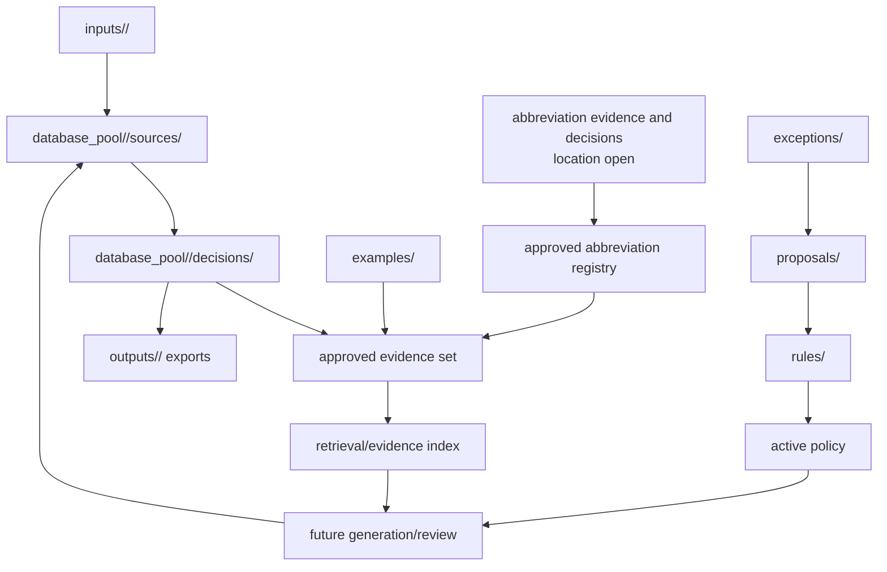

# Target Repository Structure

Status: planning artifact, not an active rulebook, schema, or naming policy.

This file sketches the desired long-term structure. It is a planning target,
not a directory migration instruction by itself.

## Target Shape

```text
inputs/
  <pool_id>/
    source files provided by beamline owner or standards source

database_pool/
  <pool_id>/
    manifest.yaml
    sources/
      *.rows.json
    decisions/
      *.decisions.json

abbreviation registry / abbreviation decisions
  location still open
  must be source-backed, reviewable, and machine-readable

rules/
  draft/
  review/
  decisions/

examples/
  good/
  bad/
  before_after/

reviews/
  <beamline-or-workstream>/

exceptions/
  <scope>/

proposals/
  rule_changes/

outputs/
  <beamline>/
    generated/exported artifacts only

schemas/
scripts/
standards/
plan/
notes/
temp/
```

## Intended Responsibilities

`inputs/` remains the only normal place for distributable source material.

`database_pool/` is the normal SEO_V3 review database area. Source rows and
decision overlays remain separate so review never destroys source evidence.

The abbreviation workflow needs a first-class, source-backed structure. The
exact location is intentionally open. Candidate options include:

- a dedicated registry path near `fixtures/` or `schemas/`;
- a rules-adjacent curated data path;
- a database-pool-owned abbreviation review area;
- a hybrid where raw abbreviation evidence and approved registry exports are
  separate.

Whatever location is chosen must support statuses such as `candidate`,
`approved`, `deprecated`, and `rejected`, and must preserve source/rationale.

`rules/` remains the only active rulebook area. Approved evidence does not
become rule authority until promoted through review/proposal.

`examples/` stores curated examples that stabilize generation and review.
Examples should be explicitly curated; they are not a hidden dump of all
approved rows.

`reviews/` stores human review reports, closeouts, and decision artifacts.

`exceptions/` and `proposals/` keep unresolved or unsupported cases visible
without silently expanding active rules.

`outputs/` should hold generated/exported results, not the normal review input
database for new SEO_V3 work.

`plan/` remains planning context unless promoted into `ARCHITECTURE.md`,
`AGENTS.md`, schemas, or rulebooks.

`notes/` remains private/local context. Important decisions that must travel
with the repository should be promoted out of notes.

`temp/` remains scratch/reference material and should not be a durable
source-of-truth path.

## Target Structure Diagram



## Migration Boundaries

Target structure changes should be made in small goals:

- update docs and active entry points before implementation;
- define abbreviation source-of-truth before approving many rows;
- add retrieval/evidence indexing after approved evidence is meaningful;
- make the web surface database-pool-native without introducing a second
  workbench;
- import/expand real pool data only after review boundaries are clear.
